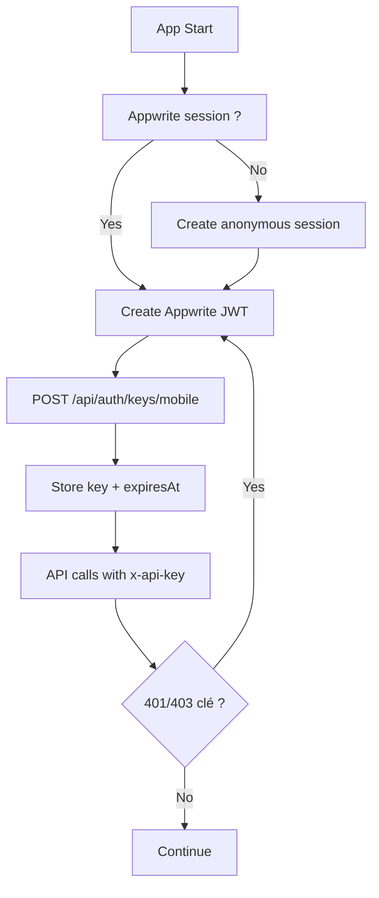

# Auth + API Key Mobile (TTL 2h)

## Flux global

## Composants
- `MobileApiKeyManager`
  - Stocke `mmt_api_key_value` et `mmt_api_key_expiry`.
  - Priorité `flutter_secure_storage`, fallback `shared_preferences`.
  - Parse tolérant:
    - `key` ou `data.key`
    - `expiresAt` ou `data.expiresAt`
    - fallback expiration `now + 2h`.
- `MobileApiClient`
  - Ajoute `x-api-key` automatiquement.
  - Ajoute `Authorization: Bearer <jwt>` pour endpoints user.
  - Refresh clé à `T-5 min`.
  - Retry automatique 1 fois sur `401/403`.

## Endpoints
- Clé mobile: `POST /api/auth/keys/mobile`
- Profil user: `GET/PATCH /api/users/me`
- Bibliothèque user:
  - `GET/POST /api/users/me/owned`
  - `PATCH/DELETE /api/users/me/owned/{volumeId}`
  - `GET/POST /api/users/me/followed`
  - `DELETE /api/users/me/followed/{subSeriesId}`

## Auth Appwrite (implémenté)
- Signup `email/password`.
- Login `email/password`.
- OAuth Google.
- Logout session courante.
- Recovery:
  - `createRecovery(...)` pour envoi mail.
  - `updateRecovery(...)` via callback `/auth/callback?userId=...&secret=...`.
- Changement mot de passe connecté (`updatePassword`).
- Suppression compte (`updateStatus` + purge locale).

## Callback `/auth/callback`
- Cas OAuth:
  - refresh session,
  - redirection `/profile` si connecté, sinon `/profile/signin`.
- Cas recovery:
  - formulaire nouveau mot de passe,
  - appel `completePasswordRecovery(...)`,
  - redirection login.
